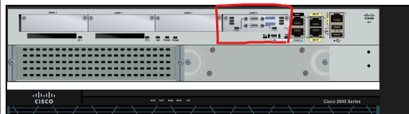
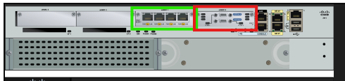
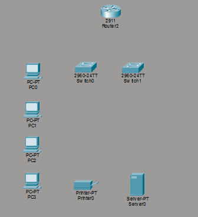
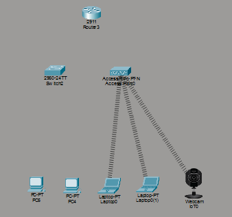
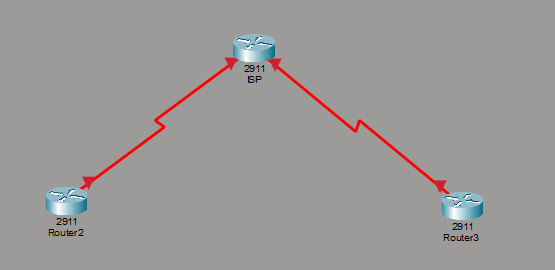
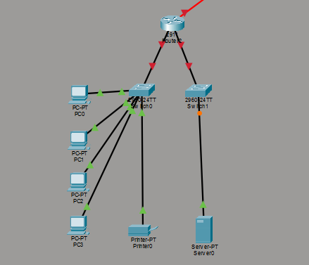
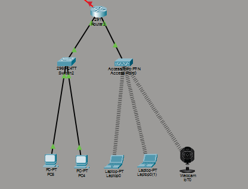

# Componentes
 

## ISP
- Router 2911 "ISP". Con el modulo de `HWIC-2T` para comunicacion serial
    

 
 

## Sucursal Montevideo
- Router  2911 "r-s-montevideo". Con la integracion de 2 moduloes `HWIC-2T` para comunicacion serial y `HWIC-4ESW` que prove 4 puertos 
- Switch 2960-24TT `switch-oficina`
- Switch 2960-24TT `switch-servidor`
- 4 Computadoras
- 1 Impresora
- 1 Servidor PT

 
 

## Sucursal Melo
- Router  2911 "r-s-melo". Con la integracion de 2 moduloes `HWIC-2T` para comunicacion serial y `HWIC-4ESW` que prove 4 puertos 
- Switch 2960-24TT `switch-melo` 
- 2 Computadoras
- 2 Laptops
- 1 AccesPoint-PT-N
- 1 Webcam

 
 

# Conexiones

 
 

Conexiones del ISP
| Origen | Puerto       | Destino                            | Puerto         |
| ------ | ------------ | ---------------------------------- | -------------- |
| ISP    | Serial 0/0/0 | Router Montevideo "r-s-montevideo" | `Serial 0/0/0` |
| ISP    | Serial 0/0/1 | Router Melo "r-s-melo"             | `Serial 0/0/0` |

 
 

Conexiones del Router Montevideo "r-s-montevideo"
| Origen                   | Puerto               | Destino                  | Puerto                |
| ------------------------ | -------------------- | ------------------------ | --------------------- |
| Router `r-s-montevideo`  | `Serial 0/0/0`       | ISP                      | `Serial 0/0/1`        |
| Router `r-s-montevideo`  | `FastEthernet 0/1/0` | Switch `switch-oficina`  | `GigabitEthernet 0/1` |
| Router `r-s-montevideo`  | `FastEthernet 0/1/1` | Switch `switch-servidor` | `GigabitEthernet 0/1` |
| Switch `switch-oficina`  | `FastEthernet 0/1`   | PC                       | `FastEthernet 0`      |
| Switch `switch-oficina`  | `FastEthernet 0/2`   | PC                       | `FastEthernet 0`      |
| Switch `switch-oficina`  | `FastEthernet 0/3`   | PC                       | `FastEthernet 0`      |
| Switch `switch-oficina`  | `FastEthernet 0/4`   | PC                       | `FastEthernet 0`      |
| Switch `switch-oficina`  | `FastEthernet 0/5`   | Impresora                | `FastEthernet 0`      |
| Switch `switch-servidor` | `FastEthernet 0/1`   | Servidor                 | `FastEthernet 0`      |

 
 

Conexiones del Router Melo "r-s-melo"
| Origen               | Puerto               | Destino              | Puerto                |
| -------------------- | -------------------- | -------------------- | --------------------- |
| Router `r-s-melo`    | `Serial 0/0/0`       | ISP                  | `Serial 0/0/1`        |
| Router `r-s-melo`    | `FastEthernet 0/1/0` | Switch `switch-melo` | `GigabitEthernet 0/1` |
|                      |
| Router `r-s-melo`      | `FastEthernet 0/1/1` | AP `AccesPoint`      | `Port 0`              |
| Switch `switch-melo` | `FastEthernet 0/1`   | PC                   | `FastEthernet 0`      |
| Switch `switch-melo` | `FastEthernet 0/1`   | PC                   | `FastEthernet 0`      |
| AP                   | RED                  | Laptop               | RED                   |
| AP                   | RED                  | Laptop               | RED                   |
| AP                   | RED                  | Webcam               | RED                   |

 

# Comandos

##### Referencias

[VLAN SVI - foro - parte 1 - 2 puertos para una sola red](https://networkengineering.stackexchange.com/questions/46436/cisco-two-interfaces-on-one-network)
[VLAN SVI - foro - parte 2](https://networkengineering.stackexchange.com/questions/46442/cisco-2811-vlans-subinterfaces-hwic-4esw)
[VLAN SVI - demostracion](https://chverma.com/smr-ral/UD08_es/841_uso_del_mdulo_hwic4esw_4_puertos_de_switch.html)
[VLAN SVI - otro](https://ipcisco.com/lesson/switch-virtual-interface-configuration-on-packet-tracer-ccnp)

### ISP
    - enable
    - configure terminal
    - hostname ISP

##### Conexiones de ISP a Montevideo
    - interface s0/0/0
    - ip address 200.100.100.1 255.255.255.252
    - clock rate 64000
    - no shutdown

##### Conexiones de ISP a Melo
    - interface s0/0/1
    - ip address 200.100.100.5 255.255.255.252
    - clock rate 64000
    - no shutdown

 

----

### Router `r-s-montevideo`
    - enable
    - configure terminal
    - hostname r-s-montevideo
  
##### Conexiones de Router a ISP
    - interface s0/0/0
    - ip address 200.100.100.2 255.255.255.252
    - no shutdown

##### Crear la vlan para unificar puertos
    - interface vlan 10
    - ip address 192.168.10.1 255.255.255.0
    - no shutdown

##### Seleccionar las interfazes a unificar
    - interface range f0/1/0-2
    - switchport mode access
    - switchport access vlan 10
    - no shutdown
    - exit

#### DHCP
    - ip dhcp excluded-address 192.168.10.1 192.168.10.20
    - ip dhcp pool lan-montevideo
    - network 192.168.10.0 255.255.255.0
    - default-router 192.168.10.1
    - dns-server 1.1.1.1
    - exit

### Switch `switch-oficina`
    - enable
    - conf t
    - hostname `switch-oficina`

##### Crear la vlan
    - vlan 10
    - name `lan-montevideo`

##### Asignar todos los puertos a la vlan
    - interface range f0/1-24
    - switchport mode access
    - switchport access vlan 10
    - no shutdown

##### Puerto de salida hacia el router
    - interface g0/1
    - switchport mode access
    - switchport access vlan 10
    - no shutdown

### Switch `switch-servidor`
    - enable
    - conf t
    - hostname `switch-servidor`

##### Crear la vlan
    - vlan 10
    - name `lan-montevideo`

##### Asignar todos los puertos a la vlan
    - interface range f0/1-24
    - switchport mode access
    - switchport access vlan 10
    - no shutdown

##### Puerto de salida hacia el router
    - interface g0/1
    - switchport mode access
    - switchport access vlan 10
    - no shutdown

 

---------

### Router `r-s-melo`
- enable
- configure terminal
- hostname r-s-melo
  
##### Conexiones de Router a ISP
- interface s0/0/0
- ip address 200.100.100.6 255.255.255.252
- no shutdown

##### Crear la vlan para unificar puertos
- interface vlan 20
- ip address 192.168.20.1 255.255.255.0
- no shutdown

##### Seleccionar las interfazes a unificar
- interface range f0/1/0-2
- switchport mode access
- switchport access vlan 20
- no shutdown
- exit
  
#### DHCP
- ip dhcp excluded-address 192.168.20.50
- ip dhcp excluded-address 192.168.20.1 192.168.20.10
- ip dhcp pool lan-melo
- network 192.168.20.0 255.255.255.0
- default-router 192.168.20.1
- dns-server 1.1.1.1
- exit

### Switch `switch-melo`
    - enable
    - conf t
    - hostname `switch-melo`

##### Crear la vlan
    - vlan 20
    - name `lan-melo`

##### Asignar todos los puertos a la vlan
    - interface range f0/1-24
    - switchport mode access
    - switchport access vlan 20
    - no shutdown

##### Puerto de salida hacia el router
    - interface g0/1
    - switchport mode access
    - switchport access vlan 20
    - no shutdown
  

# Equipos conectados
  - lan-montevideo
    - 4 pc via dhcp
    - impresora ip manual 192.168.10.20
    - servidor ip manyal 192.168.10.10
  - lan-melo
    - 2 pc via dhcp
    - 2 laptops via AP con dhcp
    - 1 webcam ip manual 192.168.20.50

# Comunicacion entre sucursales
#### Referencias
[Cisco - ip route](https://www.cisco.com/E-Learning/bulk/public/tac/cim/cib/using_cisco_ios_software/cmdrefs/ip_route.htm)

### Router `r-s-montevideo` hacia `r-s-melo`
Cualquier paquete que tenga esta `192.168.20.x` de destino se renvia hacia el ISP
- enable
- configure t
- ip route 192.168.20.0 255.255.255.0 200.100.100.1

### Router `r-s-melo` hacia `r-s-montevideo`
Cualquier paquete que tenga esta `192.168.10.x` de destino se renvia hacia el ISP
- enable
- configure t
- ip route 192.168.10.0 255.255.255.0 200.100.100.5

### Router `ISP` hacia ambas sucursales
El ISP reenvia los paquetes entre las LAN
- enable
- configure t
- ip route 192.168.10.0 255.255.255.0 200.100.100.2
- ip route 192.168.20.0 255.255.255.0 200.100.100.6
